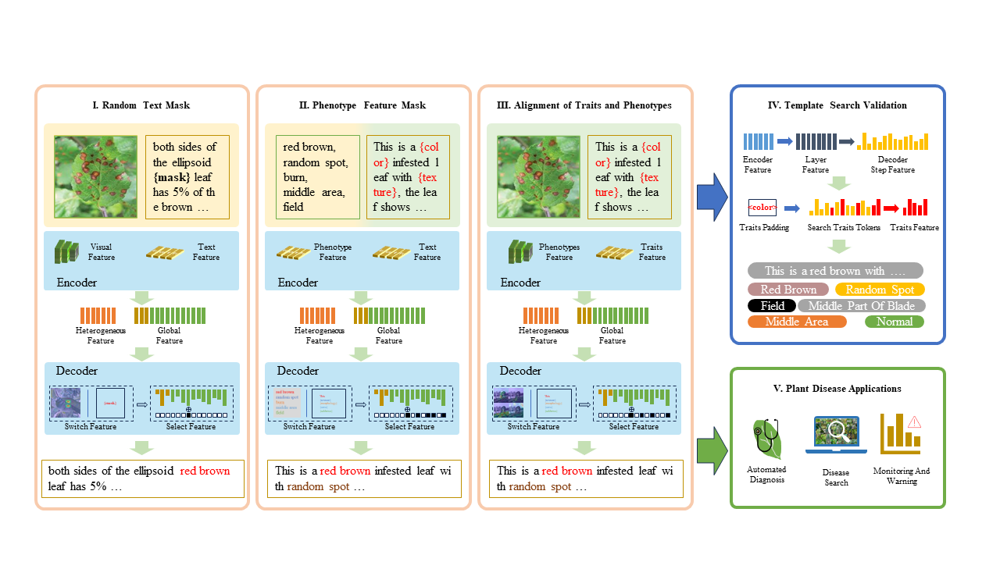

# PlanText: Gradually Masked Guidance to Align Image Phenotype with Trait Description for Plant Disease Texts Tool

We propose a new approach to enhance plant disease diagnosis using multimodal artificial intelligence techniques.
progressive masking of disease image diagnostic text, we aim to more accurately align plant phenotypes with trait
descriptions.
Our approach consists of three stages: extracting structural features of plant shape descriptions and integrating
reconstructed utterances into phenotype descriptions.
integrating the reconstructed statements into the phenotypic descriptions, and aligning image-text features to generate
dialog descriptions. The experimental results show superior performance compared to existing models, including
outperformance of GPT-4 and GPT-4o. Future work includes expanding the dataset and improving feature selection and
alignment to improve accuracy.

## Installation

clone this repository,and build it with the following command.

```shell
cd PlanText
pip install -r requirements.txt
```

## Datasets

The dataset used by our human annotation, You can get it by visiting our [website](https://plantext.samlab.cn/about.html).

## Overview

The framework of the proposed method


## Training

A way to incrementally train PlanText models on your dataset:

```
python -u main.py \
    --model ViTGPT2-Our \
    --model_path=output18 \
    --batch_size 32 \
    --pre_epoch 40 \
    --annotation your_manually_labeled_Dir
    --image_path you_images_base_path
```
or edit train debug demo train/train.sh
```shell
sh train/train.sh
```

## Test

You can generate text and labels with **--template_search**. But batch_size must be 1
```
python -u main2.py --batch_size 1 --template_search --test_epoch 20 --model_path=output18 --batch_size 1
```
Or use **--test** to generate all the required data.
```
python -u main2.py --batch_size 1 --test --test_epoch 20 --model_path=output18 --batch_size 1
```
**--test_epoch** is to specify the model batch
**--model_path** is model save path.


## Acknowledgement

Part of our code comes from the following work, and we are very grateful for their contributions to relevant research:  
[transformers](https://github.com/huggingface/transformers),  
[AdaptiveAttention](https://github.com/jiasenlu/AdaptiveAttention).  
We thank the authors and appreciate their great works!
